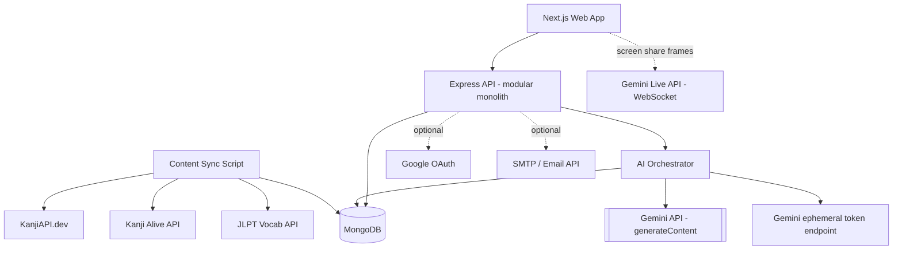
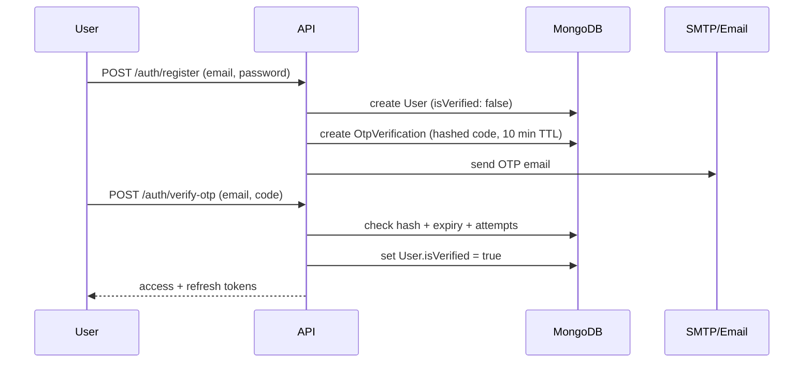
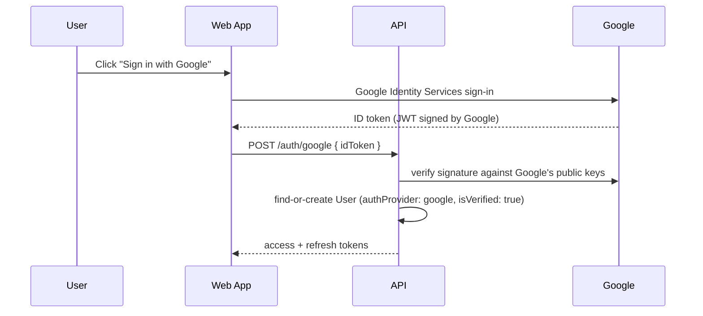
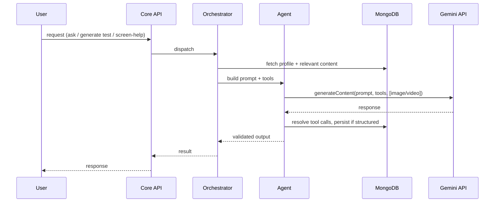
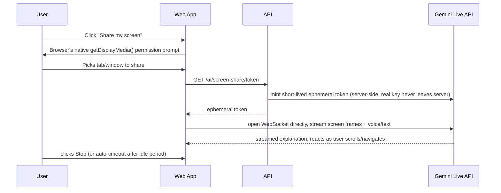

# SenseiAI — Technical Design Document

**AI-Powered Japanese Learning Platform (JLPT N5–N1)**
Status: Draft v1.2 — Phase 1 scope: Auth (password + Google OAuth + email OTP), progress/level tracking, Hiragana/Katakana/Kanji/Grammar/Particles/Vocabulary content, AI Teacher, AI-generated/evaluated tests, SRS review cards, and a site-wide floating AI assistant with screen awareness.

---

## 0. Honest Read on "Just Gemini Key + MongoDB"

Before the design: almost everything in this document runs on exactly those two credentials. Two specific features you asked for cannot — by their nature, not by choice of architecture:

| Feature | Why it needs one more credential | Cost |
|---|---|---|
| **Login with Google** | Google requires you to register an OAuth Client ID/Secret in Google Cloud Console before any app can ask "Sign in with Google" | Free, one-time setup, no recurring cost |
| **Email OTP on signup** | Sending an email requires *something* that can send email — there's no way to deliver a code to someone's inbox using only a database and an AI key | Free tier of any SMTP/email API (e.g. Gmail SMTP with an App Password, or a free tier like Resend) |

Everything else — Hiragana/Katakana/Kanji/Grammar/Particles/Vocabulary content, the AI Teacher, AI-generated tests, review cards, and the floating screen-aware assistant — is designed to run on `GEMINI_API_KEY` + `MONGODB_URI` alone. Both Google OAuth and OTP are built as **feature-flagged**: if their env vars are absent, the app runs fine with plain email/password signup (no OTP, no Google button shown); the moment you add the two extra free credentials, both light up automatically. No code branching required from you — just config presence checks.

```env
# Required
GEMINI_API_KEY=
MONGODB_URI=
JWT_ACCESS_SECRET=        # any random string you generate yourself
JWT_REFRESH_SECRET=

# Optional — enables Google login when present
GOOGLE_CLIENT_ID=
GOOGLE_CLIENT_SECRET=

# Optional — enables OTP email verification when present
SMTP_HOST=                # e.g. smtp.gmail.com, or Resend's SMTP/API
SMTP_USER=
SMTP_PASS=
```

---

## 1. System Architecture



Two things changed from the previous revision, both deliberate:
- The web app can talk **directly** to Gemini's Live API over a WebSocket for the screen-share assistant (not proxied through your own API), because round-tripping live video frames through your backend would add latency that defeats the point of "live." Your API only ever hands the browser a short-lived ephemeral token — it never hands over the real `GEMINI_API_KEY`.
- Google OAuth and SMTP are drawn as dotted/optional dependencies — the system is fully functional without them.

---

## 2. Content Strategy: Hiragana, Katakana, Kanji, Vocabulary, Grammar & Particles

| Content | Source | Why |
|---|---|---|
| Hiragana / Katakana | Static curated JSON, seeded once at launch | Only 92 characters total, perfectly stable — not worth an external dependency |
| Kanji (meanings, readings, stroke count, JLPT level) | **KanjiAPI.dev** — free, no key | 13,000+ kanji, structured JSON |
| Kanji (examples, radicals, stroke-order media) | **Kanji Alive API** (RapidAPI, free tier, CC-BY) | Richer detail view |
| Kanji stroke-order animation | **KanjiVG** (static SVG dataset, CC BY-SA) | Self-hosted, no live API call |
| Vocabulary | **JLPT Vocab API** (jlpt-vocab-api.vercel.app), free | Backbone for vocabulary + review cards |
| Vocabulary fallback lookup | **Jisho.org unofficial API**, free | Enrichment only — no SLA, not a dependency |
| Grammar & Particles | **No reliable hosted free API exists for this** (jGram has lapsed, community grammar sites are scrape-only and often copyrighted prose) — see below | — |

### 2.1 Grammar & Particles: the one place Gemini does double duty

There's a real gap here: kanji and vocabulary have clean, structured, freely-licensed APIs; grammar explanations do not — what exists is either unmaintained (jGram) or copyrighted textbook prose you can't legally scrape and republish. The fix uses the Gemini key you already have, rather than a third dependency:

1. **Curated skeleton (facts, not prose):** a static, hand-compiled JSON list per JLPT level of grammar-point *titles* and *structure patterns* (e.g. `"〜ている", "〜たい", "〜ば"`) and the standard particle list (`は, が, を, に, で, と, も, の, ...`). These are language facts, not anyone's copyrighted writing, so they're safe to ship as static seed data.
2. **Generate once, on first request:** when a user (or the content-sync script) first requests a grammar point that has no explanation yet, the Teacher Agent generates the explanation, usage notes, and example sentences in Gemini's own words — grounded by the structure pattern, not copying any source.
3. **Cache forever in MongoDB:** the generated explanation is saved back onto the `GrammarPoint` document (`source: "gemini_generated"`, `generatedAt`). Every subsequent user gets the cached version — Gemini is called once per grammar point ever, not once per user.
4. **Optional pre-warm:** run the same generation in a batch at launch for the ~80-120 core N5–N3 grammar points so the experience never has a cold-generation wait for common content.

This is the same "generate once, cache forever" pattern used elsewhere in this design (see kanji image generation in the original architecture doc) — consistent, and it keeps the *only* place original prose is generated tied to the one AI key you're already configuring.

---

## 3. Database Schema (Phase 1)

```ts
interface User {
  _id: ObjectId;
  email: string;                          // unique, indexed
  passwordHash?: string;                  // absent for Google-only accounts
  authProvider: "password" | "google";
  googleId?: string;                      // indexed, sparse-unique
  isVerified: boolean;                    // true immediately for google; gated by OTP for password
  refreshTokenVersion: number;
  createdAt: Date;
}
// Indexes: { email: 1 } unique, { googleId: 1 } sparse unique

interface OtpVerification {
  _id: ObjectId;
  email: string;
  codeHash: string;                       // never store the raw code
  purpose: "signup_verification";
  attempts: number;                       // capped, e.g. max 5 before requiring a resend
  expiresAt: Date;                        // TTL index — auto-deletes
}
// Indexes: { email: 1 }, TTL index on { expiresAt: 1 }

interface Profile {
  _id: ObjectId;
  userId: ObjectId;
  displayName: string;
  currentLevels: {
    kana: "hiragana" | "katakana" | "both_complete";
    kanji: "N5"|"N4"|"N3"|"N2"|"N1";
    vocabulary: "N5"|"N4"|"N3"|"N2"|"N1";
    grammar: "N5"|"N4"|"N3"|"N2"|"N1";
  };
  dailyGoalMinutes: number;
  timezone: string;
}

interface GrammarPoint {
  _id: ObjectId;
  title: string;                          // e.g. "〜ている"
  jlptLevel: "N5"|"N4"|"N3"|"N2"|"N1";
  category: "particle" | "verb_form" | "adjective_form" | "sentence_pattern";
  structurePattern: string;               // curated, static
  explanation?: string;                   // generated on first request
  usageNotes?: string;
  examples?: { jp: string; reading: string; en: string }[];
  source: "curated_skeleton" | "gemini_generated";
  generatedAt?: Date;
}
// Indexes: { jlptLevel: 1, category: 1 }

// Kanji, Vocabulary, Streak, DailyActivity, SrsCard, Test, TestAttempt, AgentSession
// are unchanged from the previous revision (see Section 3 of v1.1) — included here
// for continuity, with one addition: AgentSession.agentType gains "screen_assistant".
```

---

## 4. Authentication Flows

### 4.1 Email/Password + OTP



If `SMTP_*` env vars are absent, `/auth/register` simply skips the OTP step and marks `isVerified: true` immediately — degraded but functional, never broken.

### 4.2 Google OAuth



No OTP step is needed here — Google has already proven the user owns the email address. If `GOOGLE_CLIENT_ID`/`SECRET` are absent, the Google button simply isn't rendered.

---

## 5. Level Adjustment (per skill, including grammar now)

Unchanged in approach from the prior revision: `Profile.currentLevels` tracks `kana`, `kanji`, `vocabulary`, and now `grammar` independently. After each `TestAttempt`, rolling accuracy at the current level for that skill drives a deterministic level up/down/stay decision — no LLM call needed to make that decision, kept cheap and explainable.

---

## 6. AI Agent Workflow

| Agent | Responsibility | Grounding |
|---|---|---|
| **Teacher Agent** | Explains kana/kanji/vocab/grammar on request; generates grammar-point explanations on first access (cached after) | DB lookups for facts; original generated prose only for explanations/examples |
| **Test Agent** | Generates tests across kana/kanji/vocab/grammar from the user's level + due items; evaluates free-text answers | Item facts come from DB; phrasing/distractors are generated |
| **Screen Assistant Agent** | Answers "what am I looking at / what should I do here" using either a live video stream or a single screenshot of the current page | Receives page context (route, visible content) alongside the image/stream so it can ground its answer in what the page actually is, not just guess from pixels |



---

## 7. Floating AI Assistant & Screen Awareness

This is built as an in-site widget, not a browser extension — no install step, works the moment someone loads the page, and needs nothing beyond the Gemini key.

### 7.1 UI

A floating action button rendered in the Next.js root layout (so it persists across every route). Clicking it opens a panel with: a normal text chat (talks to the Teacher Agent), and a **"Help me with this screen"** action with two paths depending on what the browser/user allows.

### 7.2 Path A — Live screen share (preferred, matches "Ask Gemini" behavior)



Implementation notes: uses the browser-native `navigator.mediaDevices.getDisplayMedia()` Screen Capture API — no extension, the browser itself shows the "share this tab" picker. The client streams frames to Gemini's Live API over a direct WebSocket using the ephemeral token, which keeps `GEMINI_API_KEY` server-side while still getting low-latency live interaction. Sessions are explicitly user-started and auto-end after a short idle timeout (e.g. 3 minutes) — this is a paid, continuous-stream API, so it should never run silently in the background.

### 7.3 Path B — Screenshot fallback (when live isn't available or desired)

For browsers/devices that don't support screen capture well, or simply to keep cost down, a single-shot mode: capture one frame from the share (or a DOM screenshot via `html2canvas` if the user doesn't want to grant screen-share at all), send it with the user's question and the current route to a normal endpoint:

```text
POST /ai/screen-help
body: { imageBase64, question, currentRoute }
→ Screen Assistant Agent calls Gemini generateContent with the image + question
→ returns a text explanation
```

This is turn-based (ask → answer → ask again), not continuous, and uses the same `generateContent` call pattern as the Teacher/Test agents — no extra infrastructure.

### 7.4 Privacy & Cost Guardrails

Screen sharing is always explicitly user-initiated through the browser's own permission UI (never auto-started), a visible indicator shows while a live session is active, and sessions auto-expire on idle. Because Live API sessions cost more per minute than a normal text call, this feature should be rate-limited per user (a simple Mongo-backed counter, consistent with the no-Redis approach in Section 9) rather than left unrestricted.

---

## 8. API Design (Phase 1)

| Method | Path | Description | Auth |
|---|---|---|---|
| POST | /auth/register | Email/password signup → triggers OTP if SMTP configured | None |
| POST | /auth/verify-otp | Verify signup OTP | None |
| POST | /auth/google | Exchange Google ID token for app tokens | None |
| POST | /auth/login | Email/password login | None |
| POST | /auth/refresh | Rotate refresh token | Refresh token |
| GET | /users/me | Profile + per-skill levels | Access |
| GET | /progress/summary | Streak, goal, per-skill levels | Access |
| GET | /progress/history?range= | Activity series for graphs | Access |
| GET | /writing/hiragana, /writing/katakana | Character sets | Access |
| GET | /kanji?level=&page= / GET /kanji/:char | Kanji list/detail | Access |
| GET | /vocabulary?level= | Vocabulary list | Access |
| GET | /grammar?level=&category= / GET /grammar/:id | Grammar/particle list & detail (generates+caches on first hit) | Access |
| POST | /vocabulary/:id/save, /grammar/:id/save | Add to SRS deck | Access |
| GET | /srs/due | Cards due today | Access |
| POST | /srs/review | Submit recall grade | Access |
| POST | /tests/generate | Test Agent generates a test | Access |
| POST | /tests/:id/submit | Score + AI feedback, triggers level check | Access |
| POST | /ai/teacher/ask | Ask Teacher Agent | Access |
| GET | /ai/screen-share/token | Mint ephemeral Gemini Live token | Access |
| POST | /ai/screen-help | Screenshot-based fallback Q&A | Access |

---

## 9. Caching & Rate Limiting (still no Redis)

| Need | Approach |
|---|---|
| Hot kanji/vocab/grammar reads | In-memory LRU per process |
| AI per-user rate limiting (chat, tests, screen-share) | Mongo collection with TTL-indexed counters |
| OTP resend/attempt limiting | `OtpVerification.attempts` cap + TTL expiry |
| Auth revocation | `refreshTokenVersion` bump on `User` |

---

## 10. Feature Prioritization

### Phase 1 (this build)
Auth (password + Google OAuth + email OTP) · Profile & per-skill level tracking · Hiragana/Katakana/Kanji/Vocabulary/Grammar/Particles content (free APIs + Gemini-generated-and-cached grammar) · SRS review cards · AI Teacher · AI-generated, AI-evaluated tests · Site-wide floating AI assistant with live screen share (Gemini Live API) and screenshot fallback.

### Phase 2
Performance Analyst Agent (nuanced weakness tagging) · Study Planner Agent · OCR handwriting evaluation · Kanji historical-evolution image generation · Admin panel · Redis (once multi-instance scaling is needed).

### Phase 3
Standalone browser extension for reading arbitrary web pages (distinct from the in-site floating assistant above) · native-speaker pronunciation audio · social/leaderboard features · mobile app.

---

## 11. Tradeoffs & Risks

- **Grammar content quality depends on Gemini**, not a vetted textbook, because no clean open API/dataset exists for grammar explanations the way it does for kanji/vocab. Mitigated by grounding generation in a curated factual skeleton (titles/patterns) and human-spot-checking the pre-warmed N5–N3 set before launch.
- **Live screen-share is the most expensive feature per minute** in this design — bounded session length and per-user rate limiting are not optional polish, they're required to avoid runaway Gemini Live API cost.
- **Google OAuth and OTP each need one additional free credential** — there's genuinely no way around this for those two specific features (see Section 0), but the rest of the platform works without them.
- **Direct browser-to-Gemini WebSocket for Live API** means the ephemeral token endpoint is a real attack surface — keep tokens single-use, short-lived, and scoped only to the Live session, never reuse one across sessions.
- Everything else (no Redis, no admin panel, deferred standalone extension) carries the same tradeoffs noted in the prior revision.

---

## Appendix — Still Deferred (Phase 2/3, condensed)

### A. Admin Panel
Role-gated CRUD over content (replacing direct Mongo edits, especially useful once Grammar explanations need human review), user management, AI cost/usage analytics.

### B. Redis
Reintroduced once running more than one API instance: cross-instance content caching, shared rate-limit counters, and BullMQ queues for OCR/kanji-image-generation once those land in Phase 2.

### C. Standalone Browser Extension
A separate, installable Chrome extension for translating/analyzing *any* web page the user visits (not just SenseiAI) — distinct from the in-site floating assistant in Section 7, which only needs to understand SenseiAI's own pages and ships with zero install step.
